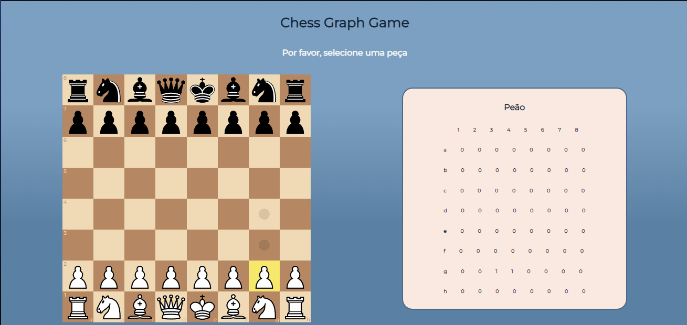
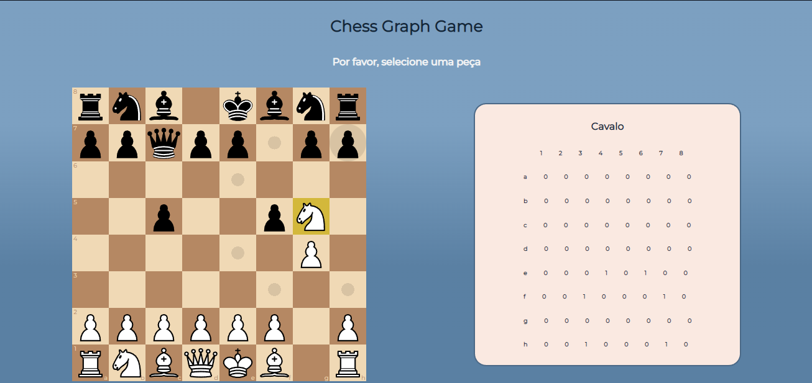
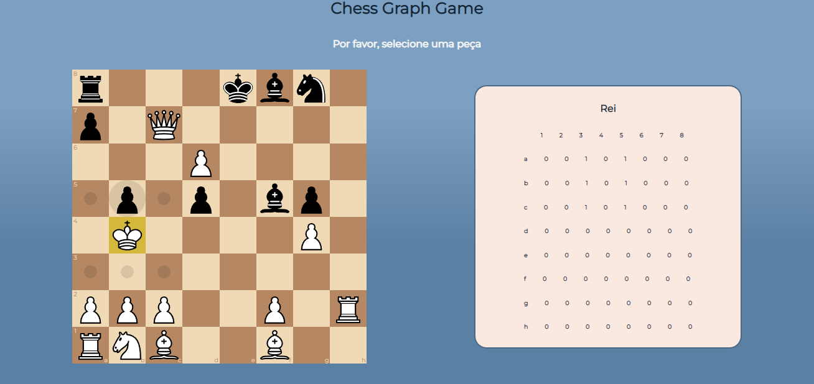
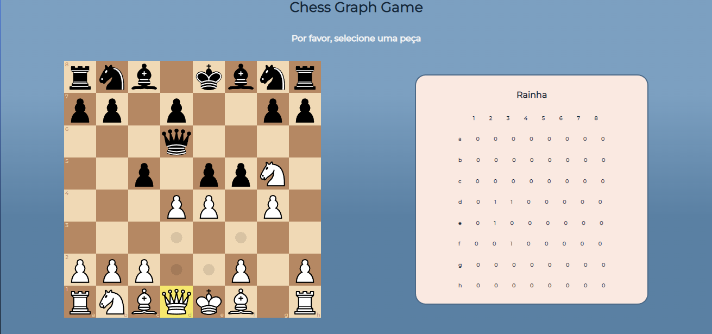

# Xadrez - Grafos 1

## Vídeo de apresentação 📹
[link para o vídeo](https://unbbr.sharepoint.com/:v:/s/Dupla1-PA/EWeZgGhZVJFCkrvDl3sHKzEBcPOA107Ix5kMklmXF_V9wQ?e=K8zbM1)

## Dupla 01 👨‍🎓👩‍🎓
|Matrícula | Aluno |
| -- | -- |
| 15/0141629  |  [Matheus Pimentel Leal](https://github.com/Matheuspleal) |
| 18/0017870  |  [Giulia Lobo Barros](https://github.com/Giuulob89) |

## Sobre 🔍
O objetivo do nosso projeto é identificar, a cada jogada de uma peça de xadrez, a matriz de adjacência dinâmica para a peça selecionada pelo jogador.

Para jogar, o usuário deve selecionar uma peça e realizar jogadas de xadrez. O diferencial do projeto é a matriz de adjacência dinâmica que é exibida ao lado do tabuleiro, mostrando uma matriz com todas as posições possíveis naquela jogada para a peça selecionada.

## Screenshots 📸

### Nenhuma peça selecionada

### Peão selecionado

### Cavalo selecionado com possibilidade de comer uma peça

### Rei relecionado


### Rainha selecionada

## Instalação 💽🧶
**Linguagem**: <br/>
**Framework**: <br/>

O projeto foi configurado com o *vite*, *yarn* e *node*.

É recomendado *node* > 16.*

## Uso ⚙️

Para rodar o projeto basta clonar o repositório
```sh
    git clone https://github.com/projeto-de-algoritmos/Grafos1_Xadrez
```

Depois entrar na pasta chessGraph
```sh
    cd chessGraph
```

Instalar as dependências rodando o comando *yarn*
```sh
    yarn
```

Rodar o projeto em localhost rodando o comando *yarn dev*
```sh
    yarn dev
```

Com isso, o projeto deve estar em: localhost:5173